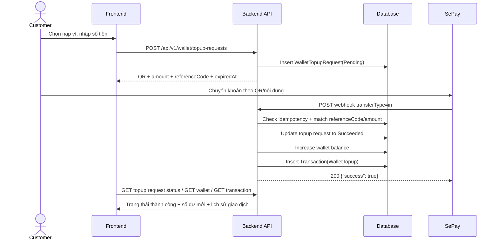

# Payment Flow Design - Wallet Top-up with SePay

## 1. Document purpose

Tài liệu này mô tả flow thanh toán đề xuất cho AutoWash Pro theo yêu cầu:

- Chỉ tích hợp SePay cho nạp tiền vào ví.
- Không hỗ trợ rút tiền từ ví ra ngoài hệ thống.
- Người dùng xem được lịch sử nạp ví và lịch sử bị trừ tiền khi thanh toán booking.
- Admin theo dõi được ai nạp tiền vào ví và ai phát sinh giao dịch tiền ra trong hệ thống.

## 2. Scope

Trong phạm vi tài liệu này:

- Tích hợp SePay cho `wallet top-up`.
- Tận dụng `wallet` và `transaction` đang có sẵn trong hệ thống.
- Giữ logic trừ tiền booking hiện tại bằng ví.
- Bổ sung flow theo dõi lịch sử cho customer và admin.

Ngoài phạm vi:

- Rút tiền từ ví về tài khoản ngân hàng.
- Refund tự động qua SePay.
- Thanh toán booking trực tiếp qua SePay thay vì qua ví.

## 3. Current backend state

Các phần đã có trong repo:

- `Wallet` lưu số dư ví theo `CustomerId`.
- `Transaction` lưu lịch sử tiền với các type:
  - `Deposit`
  - `FullPayment`
  - `WalletTopup`
- `GET /api/v1/wallet` xem số dư ví.
- `GET /api/v1/transaction` và `GET /api/v1/transaction/{id}` xem lịch sử giao dịch của customer.
- Logic booking hiện tại:
  - Khi tạo booking, hệ thống trừ tiền đặt cọc từ ví và tạo `TransactionType.Deposit`.
  - Khi check-in, hệ thống trừ phần tiền còn lại từ ví và tạo `TransactionType.FullPayment`.

Điểm chưa phù hợp để dùng production:

- `PATCH /api/v1/wallet/top-up` hiện cộng tiền trực tiếp vào ví từ request body.
- Chưa có bước tạo yêu cầu nạp tiền, chờ thanh toán, nhận webhook, chống webhook trùng và đối soát provider.
- `Transaction` hiện chưa đủ field để lưu trạng thái và mã giao dịch từ SePay.

## 4. Design principles

- SePay chỉ dùng cho dòng tiền `in` vào ví.
- Ví là nguồn thanh toán chính cho booking.
- Chỉ cộng tiền vào ví sau khi webhook SePay xác nhận giao dịch hợp lệ.
- Flow webhook phải idempotent, không cộng ví hai lần cho một giao dịch SePay.
- Admin chỉ quản lý dòng tiền nội bộ:
  - `WalletTopup` = tiền vào ví
  - `Deposit`, `FullPayment` = tiền ra khỏi ví để thanh toán dịch vụ trong hệ thống

## 5. Proposed architecture

### 5.1 Main modules

- `Wallet`: quản lý số dư ví.
- `Transaction`: ledger hiển thị lịch sử cho customer và admin.
- `WalletTopupRequest` hoặc `PaymentRequest`: bảng mới để quản lý vòng đời yêu cầu nạp ví.
- `SePayWebhookController`: endpoint nhận webhook từ SePay.
- `Admin Payment Report`: endpoint/admin screen xem dòng tiền vào và dòng tiền ra nội bộ.

### 5.2 Why need a new table

Không nên dùng thẳng `Transaction` để đại diện cho yêu cầu nạp ví đang chờ thanh toán, vì:

- `Transaction` hiện là lịch sử đã phát sinh trên ví.
- Yêu cầu nạp ví cần thêm:
  - trạng thái `Pending`, `Succeeded`, `Failed`, `Expired`
  - mã tham chiếu nội bộ
  - mã giao dịch SePay
  - raw webhook payload để audit
  - thông tin QR/payment code hết hạn

Đề xuất thêm bảng `WalletTopupRequest`.

## 6. Proposed data model

### 6.1 Existing table reused

`Transaction`

- Tiếp tục là bảng ledger cuối cùng cho lịch sử tiền.
- Chỉ insert khi nghiệp vụ đã hoàn tất:
  - nạp ví thành công
  - trừ tiền đặt cọc booking
  - trừ tiền thanh toán phần còn lại

### 6.2 New table: `WalletTopupRequest`

Đề xuất field:

- `Id`
- `CustomerId`
- `WalletId`
- `RequestedAmount`
- `Status`
  - `Pending`
  - `Succeeded`
  - `Failed`
  - `Expired`
- `Provider`
  - giá trị hiện tại: `SePay`
- `ReferenceCode`
  - mã nội bộ duy nhất để nhúng vào nội dung chuyển khoản hoặc order
- `SePayTransactionId`
  - unique, nullable trước khi thanh toán thành công
- `SePayReferenceCode`
  - mã tham chiếu ngân hàng nếu có
- `QrContent`
- `QrImageUrl` hoặc `QrPayload`
- `ExpiredAt`
- `PaidAt`
- `RawWebhookPayload`
- `CreatedAt`
- `UpdatedAt`

Ràng buộc đề xuất:

- Unique index cho `ReferenceCode`
- Unique index cho `SePayTransactionId` khi khác null

## 7. Target business flow

### 7.1 Customer creates a top-up request

1. Customer nhập số tiền muốn nạp.
2. FE gọi API tạo yêu cầu nạp ví.
3. BE validate:
   - user tồn tại
   - customer profile tồn tại
   - wallet tồn tại
   - amount > 0
   - amount đạt min/max theo config nếu có
4. BE tạo `WalletTopupRequest` trạng thái `Pending`.
5. BE sinh `ReferenceCode` duy nhất, ví dụ `TOPUP-{shortId}`.
6. BE tạo dữ liệu thanh toán SePay:
   - QR
   - số tiền
   - nội dung chuyển khoản chứa `ReferenceCode`
   - thời gian hết hạn
7. BE trả dữ liệu thanh toán cho FE.
8. FE hiển thị QR và polling trạng thái top-up request nếu cần.

### 7.2 SePay confirms payment by webhook

1. Customer chuyển khoản thành công.
2. SePay gửi webhook `transferType = in` về backend.
3. Backend xác thực request theo cấu hình SePay.
4. Backend ghi log nhận webhook.
5. Backend kiểm tra idempotency bằng `SePayTransactionId` hoặc `payload.id`.
6. Backend đối chiếu:
   - `transferType` phải là `in`
   - tìm thấy `ReferenceCode`
   - tồn tại `WalletTopupRequest` đang `Pending`
   - số tiền khớp `RequestedAmount`
7. Nếu hợp lệ, backend mở DB transaction:
   - cập nhật `WalletTopupRequest.Status = Succeeded`
   - set `PaidAt`
   - lưu `SePayTransactionId`, `SePayReferenceCode`, `RawWebhookPayload`
   - cộng `wallet.Balance`
   - insert `Transaction` type `WalletTopup`
8. Commit.
9. Trả `200` với body `{"success": true}` cho SePay.

### 7.3 Customer pays booking from wallet

Flow này giữ theo code hiện tại:

- Khi booking được tạo và đủ điều kiện thanh toán đặt cọc:
  - trừ tiền ví
  - tạo `TransactionType.Deposit`
- Khi customer check-in:
  - trừ phần tiền còn lại
  - tạo `TransactionType.FullPayment`

Điểm cần thống nhất cho UI:

- `WalletTopup`: tiền vào ví
- `Deposit`: tiền ra khỏi ví cho đặt cọc booking
- `FullPayment`: tiền ra khỏi ví cho phần thanh toán còn lại

### 7.4 Customer views wallet history

Customer dùng lịch sử giao dịch hiện có:

- `GET /api/v1/transaction`
- `GET /api/v1/transaction/{id}`

FE hiển thị:

- loại giao dịch
- số tiền
- tăng hay giảm
- mô tả
- thời gian
- booking liên quan nếu có

Mapping UI đề xuất:

- `WalletTopup` => `+amount`
- `Deposit` => `-amount`
- `FullPayment` => `-amount`

### 7.5 Admin monitors money flow

Admin cần một màn riêng để lọc toàn hệ thống theo:

- customer
- loại giao dịch
- khoảng thời gian
- trạng thái top-up request
- mã tham chiếu nội bộ
- mã giao dịch SePay

Admin nên nhìn thấy 2 nhóm:

- Tiền vào ví:
  - `WalletTopup`
- Tiền ra khỏi ví trong hệ thống:
  - `Deposit`
  - `FullPayment`

Lưu ý:

- Theo requirement hiện tại, đây không phải `withdraw to bank`.
- Nếu sau này có rút tiền ra ngoài thật, phải bổ sung transaction type mới, không dùng chung với `Deposit` hoặc `FullPayment`.

## 8. Mermaid flow

## 9. API design proposal

### 9.1 Customer APIs

Giữ:

- `GET /api/v1/wallet`
- `GET /api/v1/transaction`
- `GET /api/v1/transaction/{id}`

Thay thế:

- Không dùng `PATCH /api/v1/wallet/top-up` để cộng tiền trực tiếp nữa.

Đề xuất mới:

- `POST /api/v1/wallet/topup-requests`
  - tạo yêu cầu nạp ví
- `GET /api/v1/wallet/topup-requests`
  - xem lịch sử yêu cầu nạp ví
- `GET /api/v1/wallet/topup-requests/{id}`
  - xem chi tiết và trạng thái yêu cầu nạp

### 9.2 SePay webhook API

- `POST /api/v1/payment/sepay/webhook`

Trách nhiệm:

- nhận webhook
- xác thực
- chống trùng
- đối chiếu amount/reference
- cộng tiền ví
- tạo ledger transaction

### 9.3 Admin APIs

Đề xuất mới:

- `GET /api/v1/admin/transactions`
  - xem toàn hệ thống, không giới hạn theo customer hiện tại
- `GET /api/v1/admin/wallet-topup-requests`
  - xem danh sách yêu cầu nạp ví cùng trạng thái SePay
- `GET /api/v1/admin/wallet-topup-requests/{id}`
  - xem chi tiết một yêu cầu nạp ví

## 10. Status design

### 10.1 Wallet top-up request status

- `Pending`: đã tạo yêu cầu nạp, chưa nhận webhook hợp lệ
- `Succeeded`: đã nhận webhook hợp lệ và đã cộng ví
- `Failed`: webhook báo lỗi hoặc backend xác định giao dịch không hợp lệ
- `Expired`: quá hạn thanh toán nhưng chưa thành công

### 10.2 Transaction direction for UI/Admin

Đề xuất không cần thêm cột direction trong DB nếu team không muốn đổi schema lớn.

Có thể suy ra:

- `WalletTopup` => `In`
- `Deposit` => `Out`
- `FullPayment` => `Out`

Nếu muốn API rõ hơn, response DTO nên trả thêm field tính toán:

- `Direction`
  - `In`
  - `Out`

## 11. Validation and security rules

- Không cộng ví từ request frontend.
- Chỉ cộng ví từ webhook SePay hợp lệ.
- Mỗi webhook SePay chỉ được xử lý thành công một lần.
- `SePayTransactionId` hoặc `payload.id` phải unique.
- `ReferenceCode` phải đủ ngẫu nhiên và duy nhất.
- Webhook phải trả ACK nhanh, xử lý nặng có thể đẩy background nếu cần.
- Log đầy đủ request để audit nhưng không log secret dạng plain text.
- Endpoint webhook nên giới hạn theo auth method SePay đã cấu hình.

Theo tài liệu SePay đã kiểm tra ngày 2026-08-03:

- Webhook gửi HTTP POST thời gian thực.
- Payload có `id`, `transferType`, `transferAmount`, `code`, `referenceCode`.
- Endpoint phải trả `200/201` với `{"success": true}` trong 30 giây.
- SePay có retry nên backend bắt buộc idempotent.

## 12. Error handling

### 12.1 Top-up request creation

- `400 Bad Request`: amount không hợp lệ
- `404 Not Found`: wallet không tồn tại
- `409 Conflict`: đang có request pending trùng rule business nếu team muốn chặn

### 12.2 SePay webhook

- Webhook không match `ReferenceCode`: log lại, không cộng ví
- Webhook amount lệch amount yêu cầu: đánh dấu nghi ngờ, không cộng ví
- Webhook trùng `SePayTransactionId`: trả success nhưng không cộng lại
- Request hết hạn nhưng tiền mới vào:
  - cần rule rõ ràng
  - khuyến nghị vẫn cho phép success nếu match đúng amount và chưa từng xử lý

## 13. Testing notes

Test case tối thiểu:

- Tạo top-up request thành công.
- Nhận webhook hợp lệ, ví tăng đúng số tiền.
- Cùng một webhook gửi lặp lại 2 lần chỉ cộng ví 1 lần.
- Webhook sai amount không cộng ví.
- Webhook sai `ReferenceCode` không cộng ví.
- Customer xem lịch sử có `WalletTopup`.
- Booking tạo `Deposit` và check-in tạo `FullPayment`.
- Admin lọc được giao dịch `WalletTopup`, `Deposit`, `FullPayment`.

## 14. Open questions

- SePay bên team sẽ dùng:
  - webhook theo nội dung chuyển khoản
  - hay payment order/checkout form của SePay
- Có cần giới hạn số yêu cầu top-up pending trên mỗi user không.
- Khi top-up request đã `Expired` nhưng tiền vào muộn thì có tự cộng ví không.
- Admin chỉ cần xem audit hay còn cần duyệt tay một số giao dịch bất thường.

## 15. Recommended implementation order

1. Tạo bảng `WalletTopupRequest`.
2. Tạo API `POST /api/v1/wallet/topup-requests`.
3. Tạo webhook `POST /api/v1/payment/sepay/webhook`.
4. Chặn hoặc bỏ hẳn `PATCH /api/v1/wallet/top-up`.
5. Mở rộng admin API để xem giao dịch toàn hệ thống.
6. Bổ sung test idempotency và amount-matching.

## 16. Summary

Flow phù hợp nhất cho hệ thống hiện tại là:

- SePay chỉ dùng để xác nhận tiền nạp vào ví.
- Ví tiếp tục là nơi trừ tiền cho `Deposit` và `FullPayment`.
- `Transaction` tiếp tục là lịch sử hiển thị cho customer.
- Thêm `WalletTopupRequest` để quản lý trạng thái thanh toán với SePay.
- Admin quản lý dòng tiền nội bộ qua `WalletTopup`, `Deposit`, `FullPayment`, thay vì một flow rút tiền ra ngoài hệ thống.
